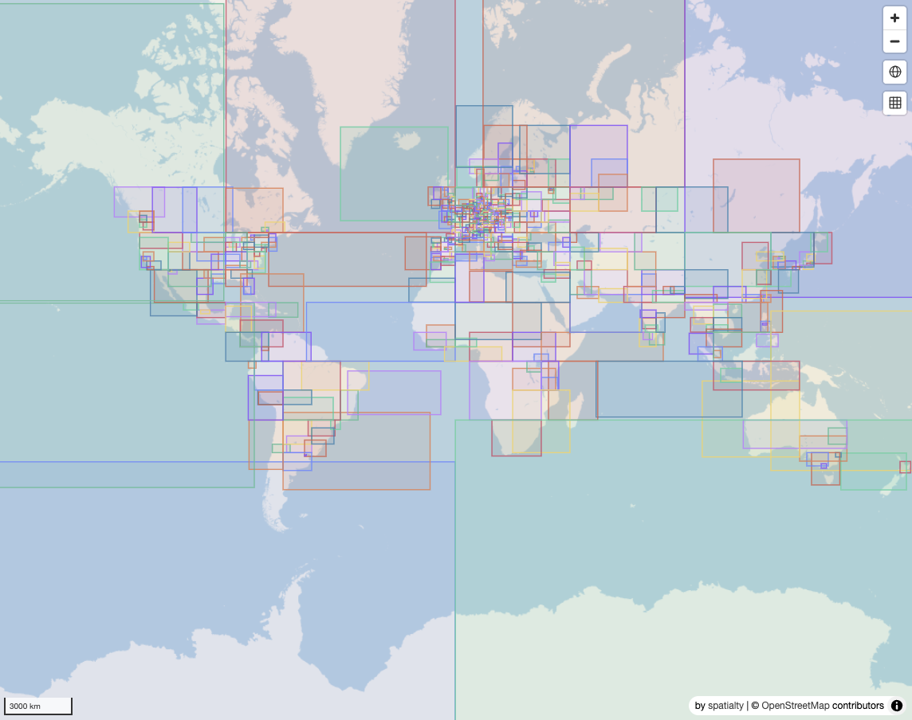
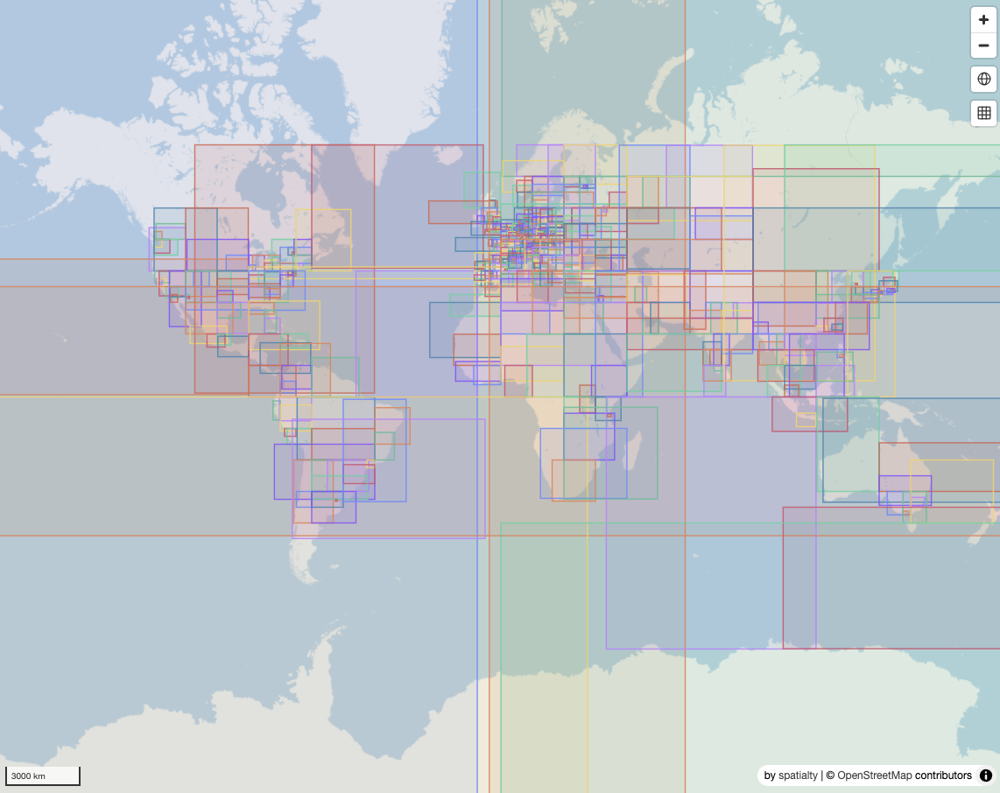
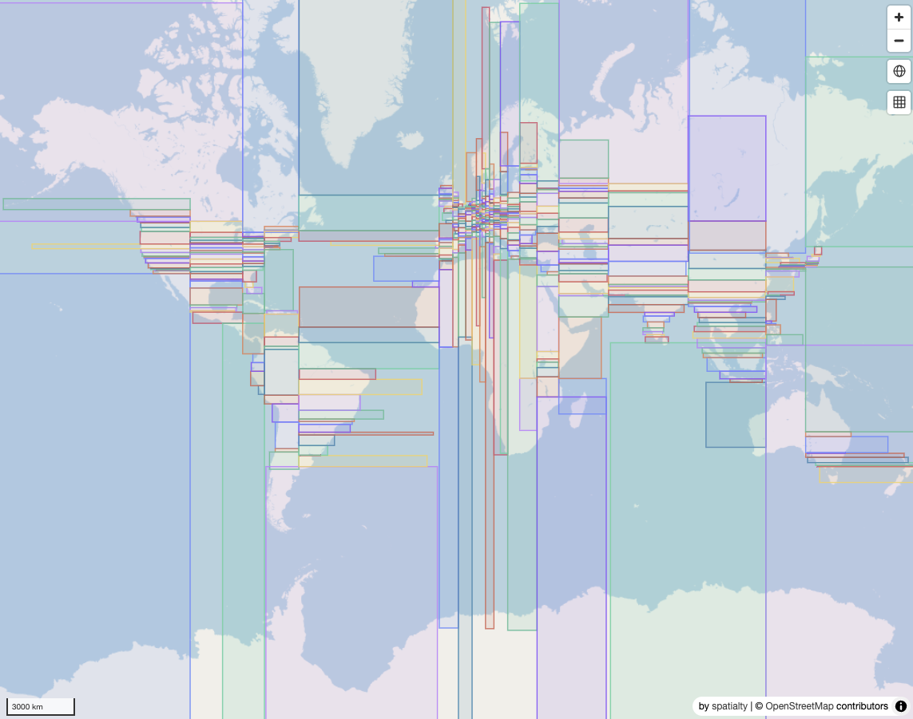
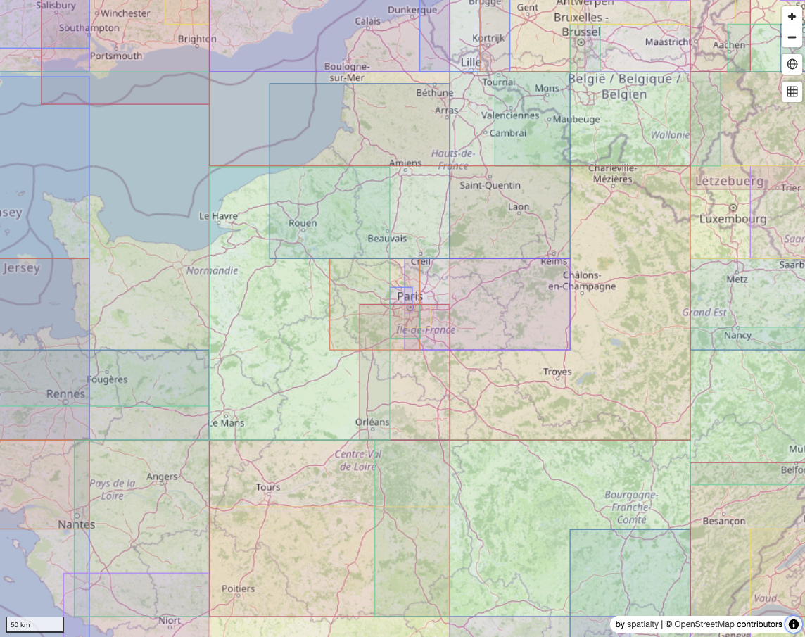
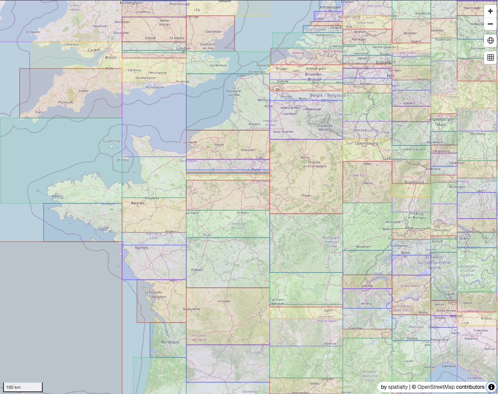

# Comparing spatial sort algorithms for well packed GeoParquet

This repository contains a comparison of spatial sort algorithms for well packed GeoParquet files. The algorithms compared are:

- Hilbert curve
- Morton curve
- Sort-Tile-Recursive

## Data

- [pois](https://cogp-demo.spatialty.io/pois.cogp.parquet) (OpenStreetMap)

## Conditions

- Row group size: 50,000 rows (`COPY ... ROW_GROUP_SIZE 50000`; DuckDB writes
  approximately 50k rows per group)
- Compression: ZSTD
- Output file format: GeoParquet v1.1

## Criteria

The algorithms are compared based on the following criteria:
- Sorting time
- Query performance
- File size
- Spatial locality (measured by how small overlap the bounding boxes of each row group are)

## Notes

- Hilbert uses DuckDB spatial's `ST_Hilbert` over the CRS84 world extent.
- Morton uses DuckDB spatial's `ST_QuadKey` at level 23. With a fixed level,
  lexicographic quadkey ordering is Z-order/Morton ordering over the Web
  Mercator tile grid.
- STR pack sorts by bbox center-x, splits rows into approximately square
  strips based on the target row group size, then sorts each strip by center-y
  with alternating direction.

## Results

Full `pois.*.parquet` build and locality results, run on 2026-06-14 with
30,052,264 rows, row group size 50,000, 587 row groups, and 8 DuckDB threads.
The build and locality CSV files are in `metrics/rg50000/`.

### Build and size

| Algorithm | Sort time (s) | File size (GiB) | Rows | Row groups |
| --- | ---: | ---: | ---: | ---: |
| Hilbert | 18.5 | 1.826 | 30,052,264 | 587 |
| Morton (`ST_QuadKey`) | 18.0 | 1.837 | 30,052,264 | 587 |
| STR pack | 40.9 | 1.829 | 30,052,264 | 587 |

### Spatial locality

Lower values are better. `sum_area` is the sum of row group bbox areas, and
`overlap_area_ratio` is pairwise overlap area divided by `sum_area`.

| Algorithm | Sum area | Median area | Pairwise overlap area | Overlap area ratio |
| --- | ---: | ---: | ---: | ---: |
| Hilbert | 76,868.4 | 5.217 | 21,870.7 | 0.285 |
| Morton (`ST_QuadKey`) | 167,793.5 | 8.223 | 202,075.2 | 1.204 |
| **STR pack** | **59,780.9** | **4.140** | **5,397.5** | **0.090** |

#### Row group bbox overlap:

| Hilbert | Morton (`ST_QuadKey`) | STR pack |
| --- | --- | --- |
|  |  |  |

Additional views:

| Hilbert | STR pack |
| --- | --- |
|  |  |

### Remote query performance

Query benchmarks target remote Parquet files. Remote benchmarks disable
DuckDB external file, HTTP metadata, Parquet metadata, and caching-operator
caches, and use a fresh DuckDB connection for each measured query. Connection
creation and extension loading are outside the timed section. Warmups are
disabled for remote runs.

Query bboxes:

| Query | xmin | ymin | xmax | ymax |
| --- | ---: | ---: | ---: | ---: |
| Tokyo | 139.55 | 35.50 | 139.95 | 35.85 |
| SF Bay | -122.65 | 37.55 | -121.75 | 38.05 |
| New York | -74.30 | 40.45 | -73.65 | 40.95 |
| London | -0.55 | 51.25 | 0.35 | 51.75 |
| Paris | 2.20 | 48.75 | 2.45 | 48.95 |
| Singapore | 103.60 | 1.20 | 104.05 | 1.50 |

Latest remote benchmark, run on 2026-06-14 with 30 measured repeats and no
warmups. Median bbox query time in milliseconds:

| Algorithm | Tokyo | SF Bay | New York | London | Paris | Singapore |
| --- | ---: | ---: | ---: | ---: | ---: | ---: |
| Hilbert | 1,524.94 | 1,149.50 | 1,077.67 | 1,254.57 | 1,180.98 | 1,038.48 |
| Morton (`ST_QuadKey`) | 1,531.49 | 1,186.80 | 1,211.90 | 1,438.93 | 1,540.82 | 1,073.98 |
| **STR pack** | **1,047.72** | **967.51** | **978.86** | **1,149.98** | **1,102.09** | **1,006.91** |

Candidate row groups by bbox column statistics. Total row groups: 587.

| Algorithm | Tokyo | SF Bay | New York | London | Paris | Singapore |
| --- | ---: | ---: | ---: | ---: | ---: | ---: |
| Hilbert | 11 | 5 | 6 | 8 | 7 | 3 |
| Morton (`ST_QuadKey`) | 11 | 6 | 8 | 10 | 12 | 4 |
| **STR pack** | **6** | **3** | **4** | **7** | **6** | **3** |

```bash
uv run python scripts/compare_spatial_sort.py bench \
  --bench-output-base https://cogp-demo.spatialty.io/bench \
  --skip-locality \
  --query-repeats 30 \
  --query-warmups 0 \
  --query-seed 42 \
  --threads 8 \
  --memory-limit 16GB \
  --metrics-dir metrics/remote
```
